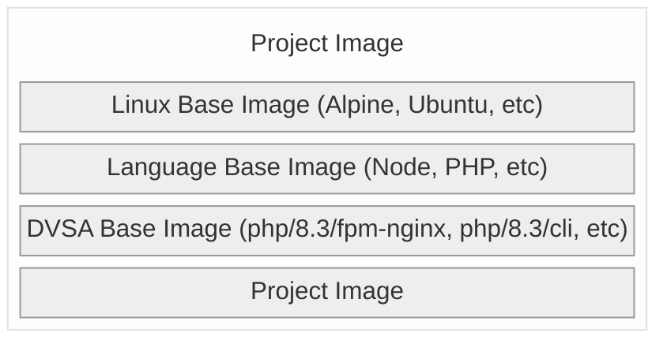
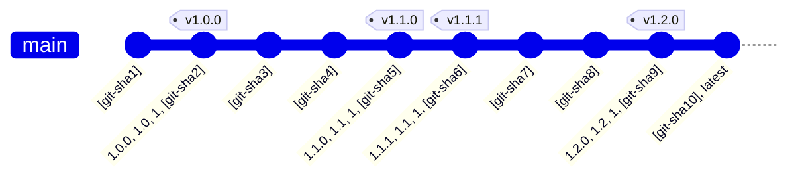

# DVSA Images
Docker Images for use in DVSA projects. The images are re-built weekly to pull in the latest patches and updates.

## How to use

<!-- `x-release-please-start-version` -->
```dockerfile
FROM ghcr.io/dvsa/dvsa-docker-images/php/8.3/fpm-nginx:0.4.0
```
<!-- `x-release-please-end` -->

> [!TIP]  
> Different specifity levels can be used to pin the image version. The most specific is the `git-sha` which is the most immutable. The least specific is `latest` which is the most mutable. See the [tagging strategy](#tagging-strategy) for more information.

## Reccommended image hierarchy



## Tagging strategy

The Docker images are tagged during the CD pipeline (running on `push` to `main` and on a `schedule`) with the following tags:



> [!WARNING]
> **Mutable tags**: `latest`, `[major].[minor]`, & `[major]`. 
> **Immutable tags**: `[major].[minor].[patch]`, & `[git-sha]`.
>
> Mutable tags are updated on `push` and `schedule`. `[git-sha]` are updated on every commit. `[major].[minor].[patch]` are updated on every release.

## Adding a new base image

> [!NOTE]  
> This repository is for _generic_ base images. Do not add project-specific images here. Project-specific images should be added to the project repository.

1. Create a new directory in the root of this repository with the name of the image you want to create. The convention is usually [language]/[version]/[flavour] e.g. `node/12/alpine`, `php/8.3/fpm-nginx` etc.

2. Create a `Dockerfile` in the directory you just created. This file should contain the instructions for building the image.

3. Update the `docker` job in `ci.yaml` and `cd.yaml` and update the matrix to add your new image. This ensures the image is build & pushed if it has changed (or during a new release).
    ```yaml
    strategy:
      fail-fast: false
      matrix:
        base:
          # ...
          - node/20/alpine
        exclude:
          # ...
          - base: ${{ github.event_name == 'schedule' || needs.release-please.outputs.release_created || contains(needs.orchestrator.outputs.changed-directories, 'node/20/alpine') && 'ignored' || 'node/20/alpine' }}
    ```
